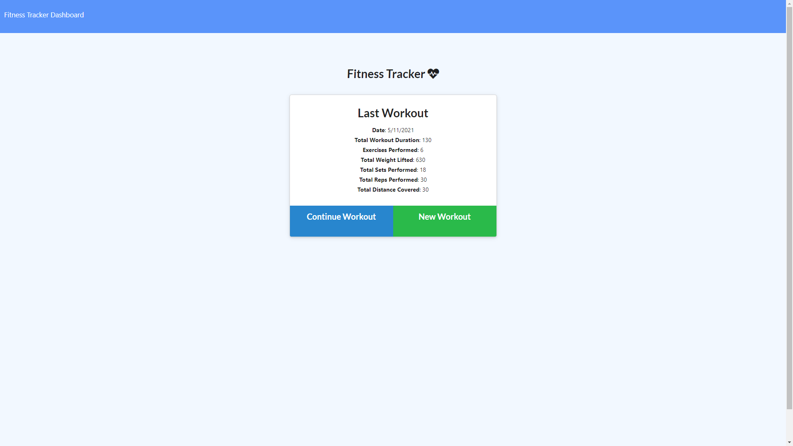
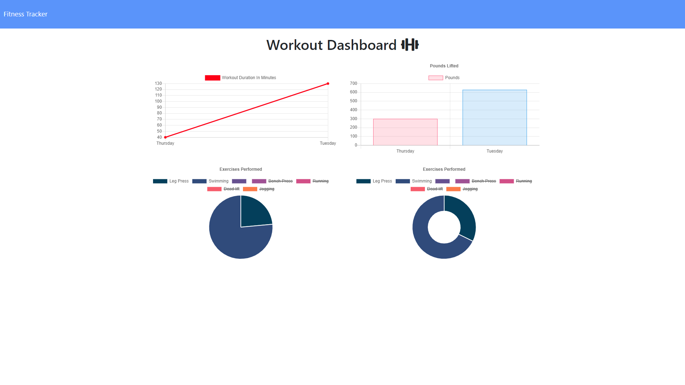

# Unit 17 NoSQL Homework: Workout Tracker

## ⋘ ──── ∗⋅◦∘◈\[[Work It!](https://workit-00.herokuapp.com/)\]◈∘◦⋅∗ ──── ⋙

A workout tracker that allows users to view, create & track daily workouts, _[Work It!](https://workit-00.herokuapp.com/)_ was created to help fitness enthusiasts manage their workout sessions whether for personal use or for their personal fitness business. **Work It!** allows users to track not only the name or type of exercise they are doing, but also the weight, sets, reps and duration of their workout sessions.

The app is conveniently deployed to the [Heroku Platform](https://www.heroku.com/), and features dynamic HTML, styling with CSS and data handling via MongoDB & Mongoose.

List of Technologies Utilized include...

- HTML, CSS, Javascript
- [Bootstrap CSS](https://getbootstrap.com/)
- [GoogleFonts](https://fonts.google.com/)
- [FontAwesome](https://fontawesome.com/)
- [GitBash](https://gitforwindows.org/)
- [Node Environment](https://nodejs.org/en/about/)
- [Express.js Framework](https://expressjs.com/)
- [MongoDB Atlas](https://www.mongodb.com/cloud/atlas)
- [Mongoose Schema](https://mongoosejs.com/)
- [Morgan package](https://www.npmjs.com/package/morgan)
- [Travis (lint)](https://www.mongodb.com/cloud/atlas)
- [Heroku Platform](https://www.heroku.com/)

## ≫ ──── ≪•◦ OBJECTIVES ◦•≫ ──── ≪

```
+ AS A fitness enthusiast
+ I WANT TO be able to log multiple exercises in a workout on a given day
+ SO THAT I may reach my fitness goals more quickly by tracking my workout progress
```

## ≫ ──── ≪•◦ MOCK-UP ◦•≫ ──── ≪

The following images show the web application's appearance & functionality:

<p float="left">
    
    
</p>

### ≫ ──── ≪•◦ CODE FUNCTIONALITY ◦•≫ ──── ≪

- Application accurately displays data from the Last (latest) Workout.

- Application allows user to choose whether to continue their previous workout or start a new workout either and adds a specified exercise accordingly.

- Application displays relevant workout data (ie workout duration & pounds lifted) in the dashboard depending on which workout option was selected (continue or new), and what exercise(s) were added

- Application is successfully deployed to Heroku via MongoDB Atlas and can be visited [here](https://workit-00.herokuapp.com/)!

### ≫ ──── ≪•◦ USABILITY ◦•≫ ──── ≪

1. Navigate to deployed application page on [Heroku](https://workit-00.herokuapp.com/)
2. Details of your last workout will be displayed on the landing page
3. Click **Continue Workout** to add additional exercises to your already existing 'workout sess'
4. Click **New Workout** to start a 'fresh sess' and add exercises to a new workout:
5. To add a **Resistance** exercise:
   > 1. Select `Resistance` from the _Exercise Type_ dropdown
   > 2. Enter the _Exercise Name_
   > 3. Input the _Weight_ (in pounds)
   > 4. Input the # of _Sets_
   > 5. Input the # of _Reps_
   > 6. Input the Duration of the exercise (in minutes)
6. To add a **Cardio** exercise:
   > 1. Select `Cardio` from the _Exercise Type_ dropdown
   > 2. Enter the _Exercise Name_
   > 3. Input the _Distance_ (in miles)
   > 4. Type in the Duration of the exercise (in minutes)
   > 5. (a) Click on **Add Exercise** to add the exercise to your current workout _OR_
   > 6. (b) Click on **Complete** to add the exercise to your workout and complete your 'workout sess'
7. Click on **Dashboard** to see your Workout Data: Workout Duration in Minutes & Pounds Lifted
8. Click on **Fitness Tracker** to return `Home` to the landing page
